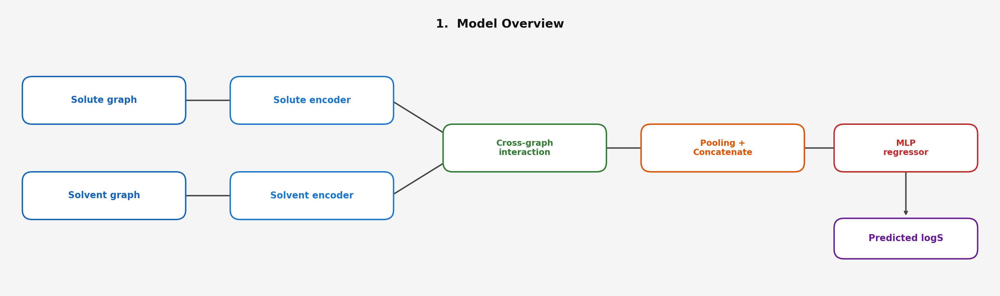
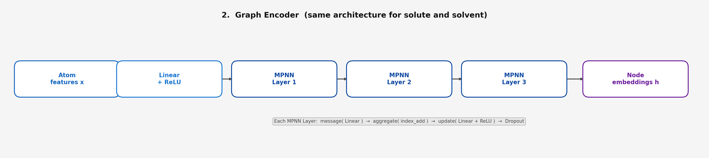
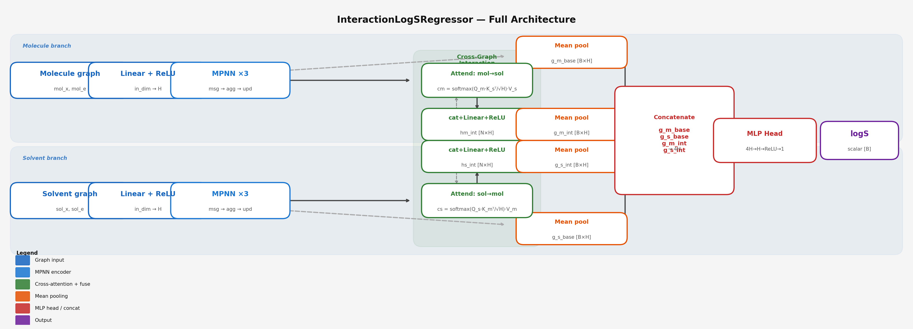

# Solubility Prediction with Dual-Graph Interaction GNN

Predicting molecular solubility (logS) from solute-solvent SMILES pairs using a **dual-graph neural network** with **bidirectional cross-attention** between solute and solvent molecular graphs.

## Highlights

- **R² = 0.90** | **RMSE = 0.388** | **MAE = 0.290** on held-out test set (15,148 samples)
- Trained on **100,983** solute-solvent pairs from [BigSolDB 2.0](https://zenodo.org/records/15094979)
- Explicit solute-solvent interaction modeling via cross-graph attention
- End-to-end pipeline: data preparation, training, and MLflow experiment tracking

---

## Model Architecture

The model takes a solute and solvent as SMILES strings, converts each to a molecular graph, encodes them independently, then models their interaction through bidirectional cross-attention before predicting logS.

### Overview

<p align="center">
  
</p>

### Graph Encoder

Both solute and solvent share the same encoder architecture: a linear projection followed by 3 stacked Message Passing Neural Network (MPNN) layers.

<p align="center">
  
</p>

### Full Architecture

<p align="center">
  
</p>

**Pipeline:**

1. **Atom featurization** (29 dimensions) — atom type, degree, hybridization, aromaticity, ring membership, H-bond donor/acceptor, formal charge
2. **Graph encoding** — `Linear(29 -> 96) + ReLU` followed by 3x `SimpleMPNNLayer` with dropout
3. **Cross-graph interaction** — bidirectional attention where solute nodes attend to solvent nodes and vice versa, producing interaction-aware embeddings
4. **Pooling & concatenation** — mean-pool base and interaction-aware embeddings from both graphs into a 384-dim vector `[g_m_base, g_s_base, g_m_int, g_s_int]`
5. **MLP head** — `Linear(384 -> 96) + ReLU + Dropout + Linear(96 -> 1)` outputs predicted logS

---

## Results

| Metric | Test Set |
|--------|----------|
| MAE    | 0.290    |
| RMSE   | 0.388    |
| R²     | 0.9015   |

Trained for 50 epochs with MSE loss, Adam optimizer (lr=1e-3, weight decay=1e-5), batch size 64.

---

## Dataset

**[BigSolDB 2.0](https://zenodo.org/records/15094979)** — a large-scale solubility database containing solute-solvent pairs with experimental logS values.

| Property | Value |
|----------|-------|
| Total records (after cleaning) | 100,983 |
| Unique solvents | 70 |
| logS range | -9.13 to +2.49 mol/L |
| Train / Val / Test split | 70% / 12.3% / 14.5% |

---

## Project Structure

```
solubility-dual-graph/
├── notebooks/
│   ├── 01_data_setup_bigsoldb.ipynb               # Download & prepare BigSolDB 2.0
│   ├── 02_dual_graph_interaction_solubility.ipynb  # Train dual-graph interaction GNN
│   └── 03_mlflow_dual_graph_interaction_solubility.ipynb  # Training with MLflow tracking
├── data/
│   ├── raw/
│   │   └── BigSolDBv2.0.csv                       # Raw dataset (downloaded by notebook 01)
│   └── processed/
│       └── solubility_pairs.csv                    # Cleaned solute-solvent pairs
├── checkpoints/                                    # MLflow model checkpoints
├── mlruns/                                         # MLflow experiment database
├── interaction_solubility_gnn.pt                   # Trained model weights
├── arch_1_overview.png                             # Architecture diagram — overview
├── arch_2_encoder.png                              # Architecture diagram — graph encoder
├── arch_full_simple.png                            # Architecture diagram — full model
├── requirements.txt
└── README.md
```

---

## Getting Started

### Installation

```bash
git clone https://github.com/<your-username>/solubility-dual-graph.git
cd solubility-dual-graph
pip install -r requirements.txt
```

### Run Notebooks (in order)

| Step | Notebook | Description |
|------|----------|-------------|
| 1 | `01_data_setup_bigsoldb.ipynb` | Downloads BigSolDB 2.0 from Zenodo, validates SMILES with RDKit, and outputs cleaned data |
| 2 | `02_dual_graph_interaction_solubility.ipynb` | Builds and trains the dual-graph interaction GNN, generates parity plots and metrics |
| 3 | `03_mlflow_dual_graph_interaction_solubility.ipynb` | Same training pipeline with MLflow experiment tracking for reproducibility |

### Quick Inference

```python
import torch
from rdkit import Chem

# Load trained model (classes defined in notebook 02)
checkpoint = torch.load("interaction_solubility_gnn.pt", map_location="cpu")
model = InteractionLogSRegressor(**checkpoint["config"])
model.load_state_dict(checkpoint["state_dict"])
model.eval()

# Predict logS for ethanol in water
predicted_logS = predict_logS("CCO", "O")
print(f"Predicted logS: {predicted_logS:.3f}")
```

### MLflow Dashboard

```bash
mlflow ui --backend-store-uri sqlite:///mlruns/mlflow.db
```

---

## Key Dependencies

| Package | Purpose |
|---------|---------|
| PyTorch | Deep learning framework |
| RDKit | Molecular graph construction & SMILES validation |
| scikit-learn | Metrics (MAE, RMSE, R²) and data splitting |
| MLflow | Experiment tracking and model registry |
| pandas / numpy | Data processing |
| matplotlib | Visualization (parity plots, loss curves) |

---

## Hyperparameters

| Parameter | Value |
|-----------|-------|
| Hidden dimension | 96 |
| Message passing steps | 3 |
| Atom feature dimension | 29 |
| Batch size | 64 |
| Learning rate | 1e-3 |
| Weight decay | 1e-5 |
| Dropout | 0.1 |
| Epochs | 50 |
| Loss function | MSE |

---

## License

This project is for research and educational purposes. The BigSolDB 2.0 dataset is sourced from [Zenodo](https://zenodo.org/records/15094979) under its original license.
